# 📊 Stock Market Real-Time Data Analytics Pipeline (AWS + Terraform)

Serverless pipeline do pobierania, przetwarzania i analizowania danych giełdowych w czasie rzeczywistym.  
**Przepływ danych:** API → Kinesis → Lambda (ingest) → S3 (RAW) + DynamoDB (CLEAN) → Glue/Athena → Lambda (trends) → SNS (e-mail).

---

## 🧭 Architektura (skrót)

1. **Producer (Python, `producer_api.py`)** – pobiera ceny z API (yfinance) i wysyła je do **Kinesis Data Streams**.  
2. **Lambda #1 – ingest** – przetwarza rekordy i zapisuje:
   - **RAW → S3** (do analizy/archiwum),
   - **CLEAN → DynamoDB** (do szybkich odczytów i trendów).
3. **AWS Glue Crawler** – kataloguje dane RAW w **Glue Data Catalog**.  
4. **Athena** – pozwala wykonywać zapytania SQL na danych w S3, wyniki zapisuje do bucketu *results*.  
5. **EventBridge** – co X minut uruchamia **Lambda #2 – trends**.  
6. **Lambda #2 – trends** – liczy sygnały (SMA/threshold) na danych z DynamoDB i publikuje do **SNS**.  
7. **SNS** – wysyła e-maile z alertami giełdowymi lub o braku danych.

---

## 📂 Struktura projektu
```txt
📁 Stock-Market-Realtime-Pipeline/
├── 📁 infra/                 # Terraform – cała infrastruktura AWS
│   ├── athena.tf
│   ├── dynamodb.tf
│   ├── eventbridge.tf
│   ├── glue.tf
│   ├── iam.tf
│   ├── kinesis.tf
│   ├── lambda.tf
│   ├── monitoring.tf
│   ├── outputs.tf
│   ├── provider.tf
│   ├── s3.tf
│   ├── sns.tf
│   ├── terraform.tfvars
│   └── variables.tf
│
├── 📁 lambda/                # Kody funkcji AWS Lambda
│   ├── ingest_handler.py     # przetwarzanie danych z Kinesis → S3 + DynamoDB
│   └── trends_handler.py     # analiza trendów + powiadomienia
│
├── 📁 tools/                 # Skrypty pomocnicze / symulacja danych giełdowych
│   ├── producer.py           # generuje przykładowe dane stock i wysyła do Kinesis
│   └── producer_api.py       # wariant do pobierania danych np. z API (do rozbudowy)
│
├── 📁 screens/               # Zrzuty ekranu architektury i działania systemu
│   └── (screenshots .png)    # np. Glue Crawler, Athena Query, DynamoDB itd.
│
├── out.json                  # przykładowy wynik / output testowy
├── payload.json              # przykładowy event wejściowy do testów Lambdy
└── README.md                 # dokumentacja projektu
```
---

## 🚀 Uruchomienie (Quick Start)

### 1. Deploy infrastruktury
```bash
cd infra
terraform init -upgrade
terraform apply -auto-approve
```
Po zakończeniu zapisz wartości z outputs.tf (nazwa strumienia Kinesis, buckety, topic SNS, nazwy Lambd).

### 2. Potwierdź subskrypcję e-mail (SNS)

Sprawdź skrzynkę pocztową i kliknij Confirm subscription. Status w SNS = Confirmed.

 ### 3. Odpal producenta danych (API)

$env:AWS_REGION="eu-west-3"
$env:KINESIS_STREAM="<kinesis_stream_name_z_outputs>"
python tools\producer_api.py

Alternatywnie: tools/producer.py (syntetyczne trendy dla szybszych testów).

✅ Test end-to-end (ze screenami)

### 1. S3 RAW
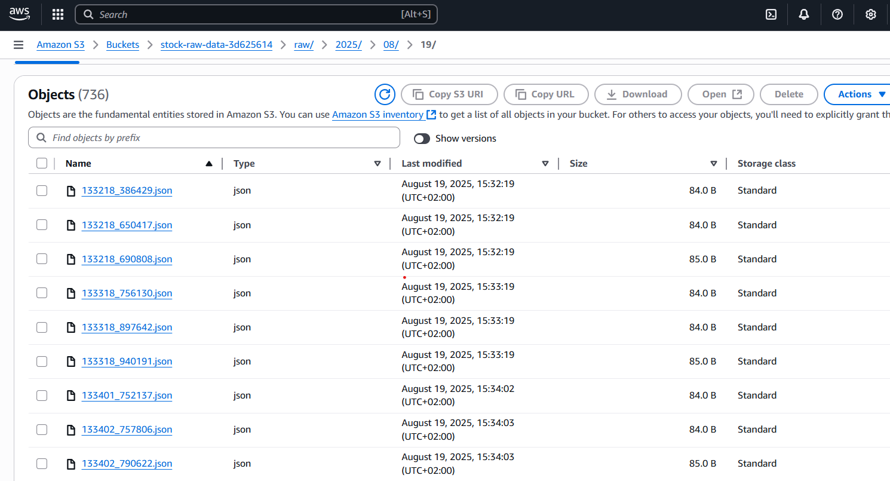

### 2. DynamoDB


### 3. Glue + Athena
**Glue Crawler – status Completed**  
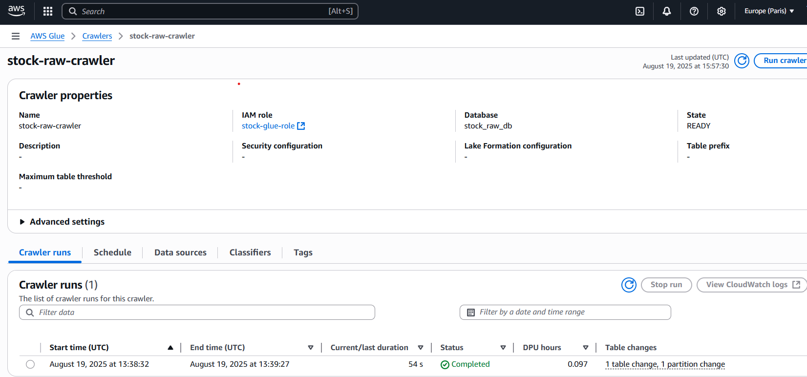

**Athena – baza `stock_raw_db`**  
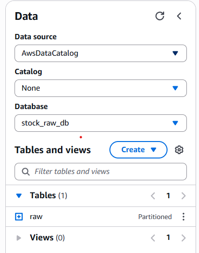

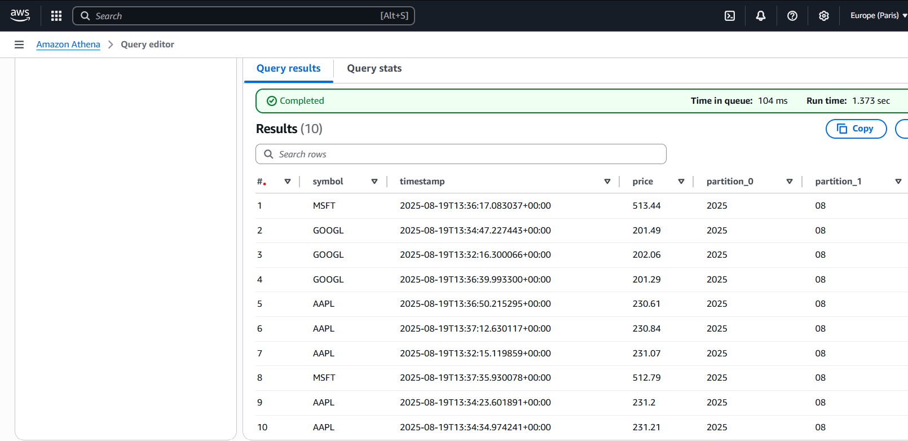

### 4. Lambda + CloudWatch
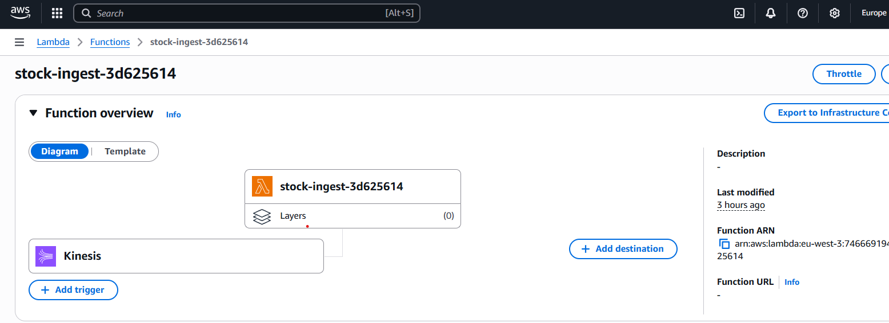
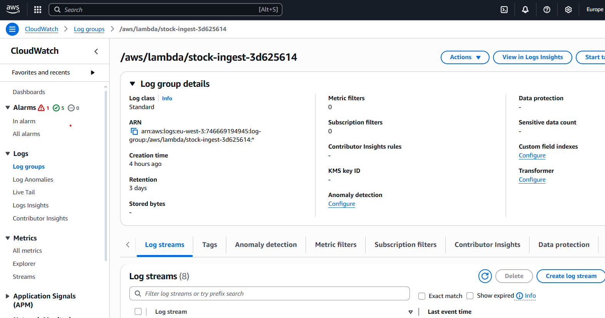
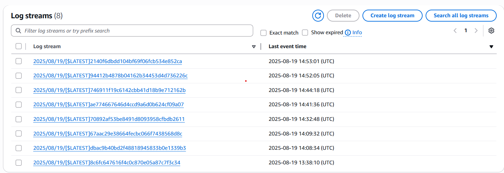

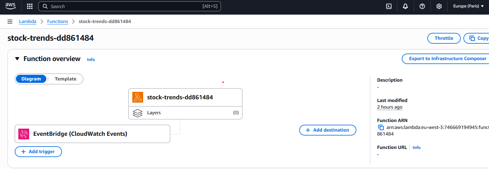
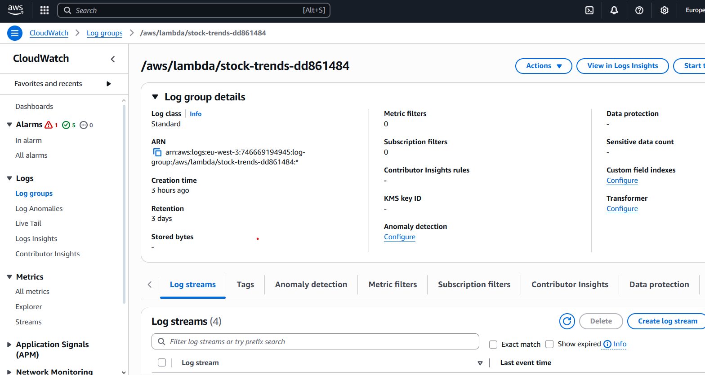
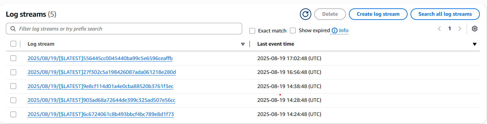

### 5. Powiadomienia SNS
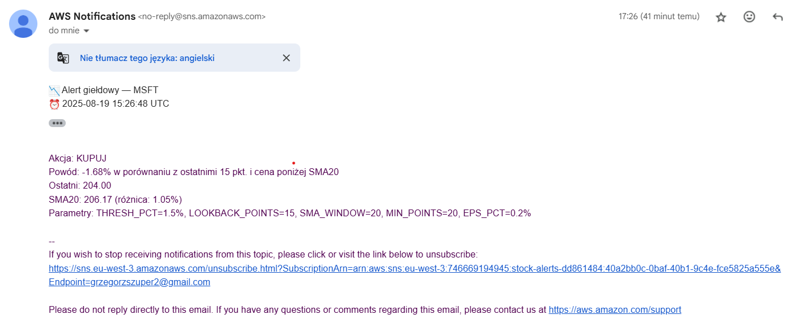
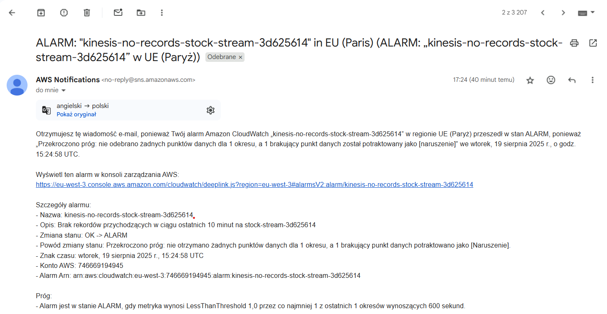


🧠 Logika alertów (Lambda trends)

Reguły:

BUY: spadek ≤ THRESH_PCT i last < SMA_WINDOW

SELL: wzrost ≥ THRESH_PCT i last > SMA_WINDOW

Filtr szumu: |last − SMA| / SMA ≥ EPS_PCT

Warunki minimalne: MIN_POINTS rekordów oraz porównanie do LOOKBACK_POINTS wstecz

Zmienne środowiskowe (Configuration → Environment variables):


🧪 Health-check (CLI)

# S3 RAW – czy nowe pliki dochodzą?
```bash
aws s3 ls s3://<raw_bucket>/raw/ --region eu-west-3

# DDB – szybki podgląd
aws dynamodb scan --table-name StockCleanedData --region eu-west-3 --max-items 5

# Athena – szybkie query
aws athena start-query-execution \
  --query-string "SELECT count(*) FROM stock_raw_db.raw;" \
  --work-group analytics \
  --result-configuration OutputLocation=s3://<athena_results_bucket>/ \
  --region eu-west-3

# Trends – ręczne uruchomienie Lambdy
aws lambda invoke --function-name <trends_lambda_name> --region eu-west-3 out.json

# SNS – test publikacji
aws sns publish --topic-arn <sns_topic_arn> --subject "Test" --message "hello" --region eu-west-3
```
🐞 Najczęstsze problemy

Brak e-maila
Sprawdź: 1) subskrypcja SNS = Confirmed, 2) logi w CloudWatch, 3) ręczne sns publish.

TABLE_NOT_FOUND w Athenie
Uruchom crawlera lub: MSCK REPAIR TABLE stock_raw_db.raw;.

Tylko 50 wpisów w DDB
Celowe limitowanie w query – sprawdź unikalność timestamp (mikrosekundy).

ResourceNotFoundException przy PutRecord
Zła nazwa strumienia – użyj wartości z Terraform outputs.

💰 Koszty

Kinesis: ok. $0.015 / shard / h

DynamoDB: on-demand (za żądania)

S3: niski koszt (małe pliki)

Lambda, EventBridge, Glue: pay-per-use

SNS: e-maile w darmowym limicie

Aby wyłączyć infrastrukturę:
```bash
cd infra
terraform destroy -auto-approve
```
👤 Autor
Grzegorz Szuper

