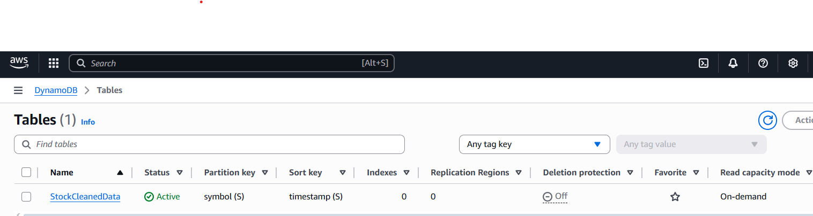

# 📊 Stock Market Real-Time Data Analytics Pipeline (AWS + Terraform)

Serverless pipeline do pobierania, przetwarzania i analizowania danych giełdowych w czasie rzeczywistym.  
**Przepływ danych:** API → Kinesis → Lambda (ingest) → S3 (RAW) + DynamoDB (CLEAN) → Glue/Athena → Lambda (trends) → SNS (e-mail).

---

## 🧭 Architektura (skrót)

1. **Producer (Python, `producer_api.py`)** – pobiera ceny z API (yfinance) i wysyła je do **Kinesis Data Streams**.  
2. **Lambda #1 – ingest** – przetwarza rekordy i zapisuje:
   - **RAW → S3** (do analizy/archiwum),
   - **CLEAN → DynamoDB** (do szybkich odczytów i trendów).
3. **AWS Glue Crawler** – kataloguje dane RAW w **Glue Data Catalog**.  
4. **Athena** – pozwala wykonywać zapytania SQL na danych w S3, wyniki zapisuje do bucketu *results*.  
5. **EventBridge** – co X minut uruchamia **Lambda #2 – trends**.  
6. **Lambda #2 – trends** – liczy sygnały (SMA/threshold) na danych z DynamoDB i publikuje do **SNS**.  
7. **SNS** – wysyła e-maile z alertami giełdowymi lub o braku danych.

---

## 📂 Struktura projektu

---

## 🚀 Uruchomienie (Quick Start)

### 1. Deploy infrastruktury

cd infra
terraform init -upgrade
terraform apply -auto-approve

Po zakończeniu zapisz wartości z outputs.tf (nazwa strumienia Kinesis, buckety, topic SNS, nazwy Lambd).

2. Potwierdź subskrypcję e-mail (SNS)

Sprawdź skrzynkę pocztową i kliknij Confirm subscription. Status w SNS = Confirmed.

3. Odpal producenta danych (API)

$env:AWS_REGION="eu-west-3"
$env:KINESIS_STREAM="<kinesis_stream_name_z_outputs>"
python tools\producer_api.py

Alternatywnie: tools/producer.py (syntetyczne trendy dla szybszych testów).

✅ Test end-to-end (ze screenami)

### 1. S3 RAW

### 2. DynamoDB

### 3. Glue + Athena
**Glue Crawler – status Completed**  

**Athena – baza `stock_raw_db`**  

### 4. Lambda + CloudWatch

### 5. Powiadomienia SNS

🧠 Logika alertów (Lambda trends)

Reguły:

BUY: spadek ≤ THRESH_PCT i last < SMA_WINDOW

SELL: wzrost ≥ THRESH_PCT i last > SMA_WINDOW

Filtr szumu: |last − SMA| / SMA ≥ EPS_PCT

Warunki minimalne: MIN_POINTS rekordów oraz porównanie do LOOKBACK_POINTS wstecz

Zmienne środowiskowe (Configuration → Environment variables):

🧪 Health-check (CLI)

# S3 RAW – czy nowe pliki dochodzą?
aws s3 ls s3://<raw_bucket>/raw/ --region eu-west-3

# DDB – szybki podgląd
aws dynamodb scan --table-name StockCleanedData --region eu-west-3 --max-items 5

# Athena – szybkie query
aws athena start-query-execution \
  --query-string "SELECT count(*) FROM stock_raw_db.raw;" \
  --work-group analytics \
  --result-configuration OutputLocation=s3://<athena_results_bucket>/ \
  --region eu-west-3

# Trends – ręczne uruchomienie Lambdy
aws lambda invoke --function-name <trends_lambda_name> --region eu-west-3 out.json

# SNS – test publikacji
aws sns publish --topic-arn <sns_topic_arn> --subject "Test" --message "hello" --region eu-west-3

🐞 Najczęstsze problemy

Brak e-maila
Sprawdź: 1) subskrypcja SNS = Confirmed, 2) logi w CloudWatch, 3) ręczne sns publish.

TABLE_NOT_FOUND w Athenie
Uruchom crawlera lub: MSCK REPAIR TABLE stock_raw_db.raw;.

Tylko 50 wpisów w DDB
Celowe limitowanie w query – sprawdź unikalność timestamp (mikrosekundy).

ResourceNotFoundException przy PutRecord
Zła nazwa strumienia – użyj wartości z Terraform outputs.

💰 Koszty

Kinesis: ok. $0.015 / shard / h

DynamoDB: on-demand (za żądania)

S3: niski koszt (małe pliki)

Lambda, EventBridge, Glue: pay-per-use

SNS: e-maile w darmowym limicie

Aby wyłączyć infrastrukturę:

cd infra
terraform destroy -auto-approve

👤 Autor
Grzegorz Szuper

