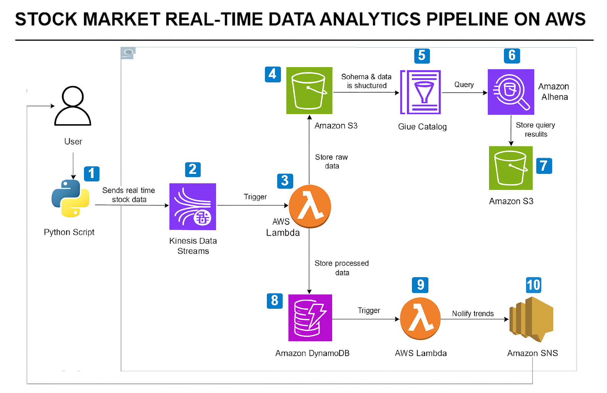

📊 Stock Market Real-Time Data Analytics Pipeline (AWS + Terraform)

Serverless pipeline do pobierania, przetwarzania i analizowania danych giełdowych w czasie rzeczywistym.
Strumień → Kinesis → Lambda (ingest) → S3 (RAW) + DynamoDB (CLEAN) → Glue/Athena → Lambda (trends) → SNS (e-mail).

🧭 Architektura (skrót)

Python (producer_api.py) pobiera ceny (yfinance) i wysyła je do Kinesis Data Streams

Lambda #1 – ingest przetwarza rekord i zapisuje:

RAW → S3 (do analizy/archiwum)

CLEAN → DynamoDB (do szybkich odczytów i trendów)

Glue Crawler kataloguje RAW z S3 w Glue Data Catalog

Athena uruchamia SQL na danych w S3, wyniki zapisuje do S3 (bucket „results”)

EventBridge co X minut odpala Lambda #2 – trends

Lambda #2 liczy sygnały (SMA/threshold) na danych z DynamoDB i publikuje do SNS

SNS wysyła e-maile z alertami
.
├─ infra/                 # Terraform (infrastruktura)
│  ├─ athena.tf           # Workgroup, lokalizacja wyników (S3), powiązania z Glue
│  ├─ dynamodb.tf         # Tabela CLEAN: StockCleanedData (symbol, timestamp, price)
│  ├─ eventbridge.tf      # Rule (cron) → wyzwala Lambdę trends co X min
│  ├─ glue.tf             # Glue Database + Crawler (skanuje S3/raw → Data Catalog)
│  ├─ iam.tf              # Role/polityki: lambdy, glue, dostępy do S3/Kinesis/DDB/Logs
│  ├─ kinesis.tf          # Strumień Kinesis (wejście), shard(y)
│  ├─ lambda.tf           # Definicje obu Lambd + event source mapping Kinesis→ingest
│  ├─ monitoring.tf       # Log groups, retencje (CloudWatch)
│  ├─ outputs.tf          # Wypisuje nazwy/ARN-y (dla README/testów)
│  ├─ provider.tf         # Provider + region
│  ├─ s3.tf               # Buckety: RAW + Athena results
│  ├─ sns.tf              # Topic „stock-alerts-…”, subskrypcja e-mail (var.alert_email)
│  ├─ terraform.tfvars    # Twoje wartości (np. alert_email)
│  └─ variables.tf        # Definicje zmiennych
│
├─ lambda/
│  ├─ ingest_handler.py   # Kinesis event → zapis do S3(raw) + DynamoDB(clean)
│  └─ trends_handler.py   # Czyta z DDB, liczy SMA/threshold, wysyła e-mail przez SNS
│
├─ tools/
│  ├─ producer_api.py     # Real-time z API (yfinance) → Kinesis
│  └─ producer.py         # Generator syntetycznych trendów (łatwy test alertów)
│
├─ screens/               # Screeny do README (wstawisz później)
│  ├─ architecture.png
│  ├─ s3_raw.png
│  ├─ dynamodb.png
│  ├─ glue_crawler.png
│  ├─ athena_show_tables.png
│  ├─ athena_query.png
│  ├─ cw_ingest.png
│  ├─ cw_trends.png
│  └─ sns_email.png
│
├─ out.json               # Wyjście z testowego `aws lambda invoke` (trends)
├─ payload.json           # Przykładowy event do testów (jeśli używasz ręcznie)
└─ README.md

🚀 Uruchomienie (Quick Start)

Deploy infrastruktury

cd infra
terraform init -upgrade
terraform apply -auto-approve

Po zakończeniu zapisz wyjścia z outputs.tf (nazwa strumienia Kinesis, buckety, topic SNS, nazwy Lambd).

Potwierdź subskrypcję e-mail (SNS)
Sprawdź skrzynkę i kliknij „Confirm subscription”. Status w SNS = Confirmed.

Odpal producenta danych (API)

# PowerShell
$env:AWS_REGION="eu-west-3"
$env:KINESIS_STREAM="<wartość z outputs: kinesis_stream_name>"
python tools\producer_api.py

Alternatywnie: tools/producer.py (syntetyczne trendy dla szybkich alertów).

✅ Test end-to-end (z checklistą screenów)

S3 RAW – pojawiają się pliki JSON w raw/

DynamoDB – w tabeli StockCleanedData widać świeże rekordy

Glue Crawler – status Completed

Athena – baza stock_raw_db

SHOW TABLES;
SELECT * FROM stock_raw_db.raw LIMIT 10;
SELECT symbol, MAX(price) AS max_price FROM stock_raw_db.raw GROUP BY symbol;

Lambda trends – uruchamia się co X min (EventBridge), logi w CloudWatch

SNS e-mail – przychodzi alert (BUY/SELL)

🧠 Logika alertów (trends_handler.py)

Reguła PCT + SMA:

BUY: spadek ≤ THRESH_PCT i last < SMA_WINDOW

SELL: wzrost ≥ THRESH_PCT i last > SMA_WINDOW

filtr szumu: |last − SMA| / SMA ≥ EPS_PCT

minimalna liczba punktów: MIN_POINTS

porównanie z ceną sprzed LOOKBACK_POINTS ostatnich próbek

Zmienne środowiskowe (Lambda → Configuration → Environment variables):

Key	Przykład	Co robi
DYNAMODB_TABLE	StockCleanedData	źródło danych do trendów
SNS_TOPIC_ARN	arn:aws:sns:eu-west-3:…:stock-alerts-…	gdzie publikować alerty
THRESH_PCT	1.5	próg zmiany %
LOOKBACK_POINTS	15	porównanie do N-tego punktu wstecz
SMA_WINDOW	20	okno średniej kroczącej
MIN_POINTS	20	min. liczba punktów do decyzji
EPS_PCT	0.2	filtr szumu (odchyłka od SMA w %)
ALERT_LANG	pl / en	język treści maila
INCLUDE_JSON_FOOTER	false	dołącz surowy JSON (debug)

Na testy możesz dać: THRESH_PCT=0.3, LOOKBACK_POINTS=5, SMA_WINDOW=5, MIN_POINTS=5, EPS_PCT=0.1.

🧪 Health-check (CLI)

# S3 RAW – czy nowe pliki dochodzą?
aws s3 ls s3://<raw_bucket>/raw/ --region eu-west-3

# DDB – szybki podgląd
aws dynamodb scan --table-name StockCleanedData --region eu-west-3 --max-items 5

# Athena – szybki query (zapisze CSV do bucketu wyników)
aws athena start-query-execution \
  --query-string "SELECT count(*) FROM stock_raw_db.raw;" \
  --work-group analytics \
  --result-configuration OutputLocation=s3://<athena_results_bucket>/ \
  --region eu-west-3

# Trends – ręczne uruchomienie Lambdy
aws lambda invoke --function-name <trends_lambda_name> --region eu-west-3 out.json

# SNS – test publikacji
aws sns publish --topic-arn <sns_topic_arn> --subject "Test" --message "hello" --region eu-west-3

🐞 Najczęstsze problemy

Brak e-maila

subskrypcja SNS „Confirmed”; 2) CloudWatch Logs trends – czy alerts_count>0; 3) ręczny sns publish działa.

TABLE_NOT_FOUND w Athenie
Uruchom crawlera lub MSCK REPAIR TABLE stock_raw_db.raw;.

W DDB „tylko 50” wpisów
Query w trends pobiera Limit=… (to celowe); upewnij się, że timestamp jest unikalny (mikrosekundy), by nie nadpisywać itemów.

ResourceNotFoundException przy PutRecord
Zła nazwa strumienia – użyj tej z Terraform outputs.

💰 Koszty

Kinesis ~ $0.015 / shard / h

DynamoDB on-demand (za żądania)

S3 – grosze (małe pliki)

Lambda / EventBridge / Glue – pay-per-use

SNS – e-maile w darmowym limicie

Pauza projektu: terraform destroy -auto-approve.

## Architektura systemu

Poniżej przedstawiono schemat architektury całego rozwiązania:

---

## Składowanie danych w S3 (RAW)

Wszystkie dane wchodzące do systemu są zapisywane w **S3 (bucket RAW)**. 
Każdy plik zawiera pojedynczy rekord w formacie JSON, co umożliwia analizę historyczną.

---

## AWS Glue + Athena

Dane z S3 są strukturyzowane przy pomocy **AWS Glue Crawler**, a następnie analizowane za pomocą **Amazon Athena**.

- Glue Crawler:

- Athena Query:

---

## DynamoDB

Część danych jest zapisywana w **Amazon DynamoDB** dla szybkiego dostępu w czasie rzeczywistym:

---

## Powiadomienia SNS

System generuje dwa typy powiadomień:

1. **Alert giełdowy** (np. sygnał KUPUJ/SPRZEDAJ):
   
   

2. **Alarm o braku danych** (jeśli Kinesis nie odbiera danych od dłuższego czasu):

   

---

👤 Autor
Grzegorz Szuper•https://github.com/grzegorzszuper